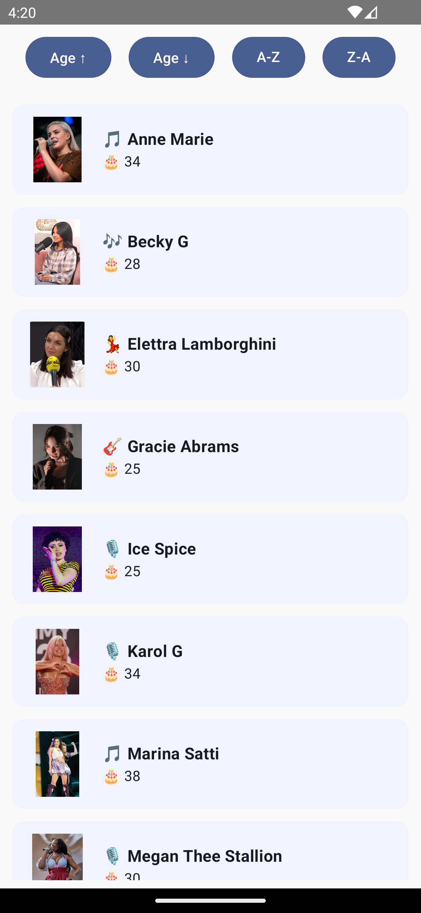
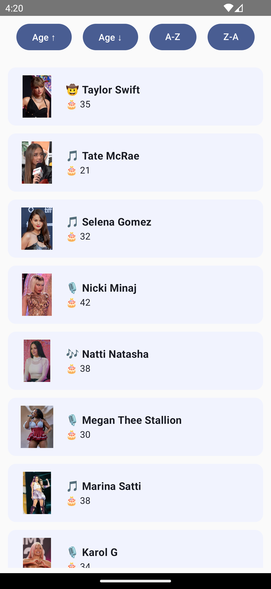

# 🎶 Compose Artist List


A **Jetpack Compose** sample app that renders a list of artists in a clean, card-based layout. Each item shows an image, age, name, country and music genre. Perfect for demos, tutorials, or as a starting point for your own Compose lists! ✨

---

## 🚀 Features

- **Modern card layout** with artist photos
- **Multi-line support**: long names and genres wrap into new lines
- **Dynamic data**: loaded via a repository pattern
- **Material 3** typography & theming
- **Previewable UI** with `@Preview` functions
- **MVVM architecture** powered by **Flow** and **Coroutines**
- **Clean Architecture** separation with `domain`, `data` and `di` modules
- **Dagger Hilt** dependency injection
- **Coil** image loading

---

### 📸 Additional Screens

<p align="center">
  
  <br/>
  <em>Default artist list view</em>
</p>

<p align="center">
  
  <br/>
  <em>List sorted by age (ascending)</em>
</p>

<p align="center">
  
  <br/>
  <em>List sorted by age (descending)</em>
</p>

<p align="center">
  
  <br/>
  <em>List sorted alphabetically (A-Z)</em>
</p>

<p align="center">
  
  <br/>
  <em>List sorted alphabetically (Z-A)</em>
</p>

<p align="center">
  
  <br/>
  <em>Artist detail page</em>
</p>

<p align="center">
  
  <br/>
  <em>Overall architecture overview</em>
</p>


---

## 🔧 Getting Started

1. **Clone** the repo:  
   ```bash
   git clone https://github.com/halilozel1903/LazycolumnDataGrid.git
   cd compose-artist-list
   ```
2. **Open** in Android Studio Arctic Fox or newer.  
3. **Run** on emulator or device:  
   - API 21+  
   - Material 3 theme enabled  
4. **Explore** the `data` and `domain` layers along with `PersonViewModel` for a full MVVM setup. 🧐

---

## 📂 Project Structure

```
├── app/
│   ├── src/main/
│   │   ├── AndroidManifest.xml
│   │   ├── assets/people.json
│   │   └── java/com/halil/ozel/recyclerviewsample/
│   │       ├── data/                # Repository implementation
│   │       ├── di/                  # Hilt modules
│   │       ├── domain/              # Repository interfaces
│   │       ├── ui/theme/            # Compose theme definitions
│   │       ├── CustomItem.kt
│   │       ├── EmojiUtils.kt
│   │       ├── MainActivity.kt
│   │       ├── MyApplication.kt
│   │       ├── Person.kt
│   │       └── PersonViewModel.kt
│   ├── src/androidTest/             # Instrumentation tests
│   └── src/test/                    # Unit tests
├── gradle/                          # Wrapper and version catalog
├── build.gradle.kts                 # Root Gradle build file
├── settings.gradle.kts              # Module declarations
├── gradlew & gradlew.bat            # Gradle wrappers
├── README.md                        # ← you are here!
└── *.png                            # App screenshots
```

---

## 🤝 Contributing

1. Fork it! 🍴 
2. Create your feature branch: `git checkout -b feature/YourFeature`  
3. Commit your changes: `git commit -m 'Add awesome feature'`  
4. Push to the branch: `git push origin feature/YourFeature`  
5. Open a Pull Request 📝 

---

## Donation 💸

If this project help 💁 you to develop, you can give me a cup of coffee. ☕

[](https://www.buymeacoffee.com/halilozel1903)

---

## 📜 License
```
MIT License

Copyright (c) 2025 Halil OZEL

Permission is hereby granted, free of charge, to any person obtaining a copy
of this software and associated documentation files (the "Software"), to deal
in the Software without restriction, including without limitation the rights
to use, copy, modify, merge, publish, distribute, sublicense, and/or sell
copies of the Software, and to permit persons to whom the Software is
furnished to do so, subject to the following conditions:

The above copyright notice and this permission notice shall be included in all
copies or substantial portions of the Software.

THE SOFTWARE IS PROVIDED "AS IS", WITHOUT WARRANTY OF ANY KIND, EXPRESS OR
IMPLIED, INCLUDING BUT NOT LIMITED TO THE WARRANTIES OF MERCHANTABILITY,
FITNESS FOR A PARTICULAR PURPOSE AND NONINFRINGEMENT. IN NO EVENT SHALL THE
AUTHORS OR COPYRIGHT HOLDERS BE LIABLE FOR ANY CLAIM, DAMAGES OR OTHER
LIABILITY, WHETHER IN AN ACTION OF CONTRACT, TORT OR OTHERWISE, ARISING FROM,
OUT OF OR IN CONNECTION WITH THE SOFTWARE OR THE USE OR OTHER DEALINGS IN THE
SOFTWARE.
```
